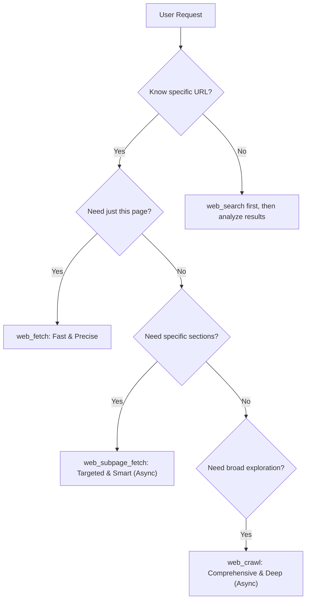

# Web Fetch Capabilities & Configuration

## 📖 中文学习注解

### 本文核心摘要
本文档说明 Shannon 的网页抓取工具套件——三种不同深度的抓取能力：web_fetch（单页精确提取）、web_subpage_fetch（智能多页提取，Map+Scrape 模式按相关性评分筛选子页面）、web_crawl（深度递归爬虫，Firecrawl 异步 API）。文档包含工具的 LLM 决策逻辑流程图（根据用户需求自动选择合适工具）、相关性评分算法详解、配置选项和 Provider 对比。

### 章节导航
- **Tools Overview**: web_fetch（单页）/ web_subpage_fetch（智能多页）/ web_crawl（深度爬虫）三种工具
- **LLM Decision Logic**: 决策流程图——知道 URL？→ 仅需该页？→ 选择对应工具
- **Relevance Scoring**: web_subpage_fetch 的相关性评分（路径匹配/关键字/URL 深度/长度）
- **Tool Configuration**: 各工具的配置参数（max_pages/timeout/user_agent 等）
- **Provider Comparison**: Firecrawl 与纯 Python BFS 爬虫方案的对比

### 与 AI Agent 体系的关联
- 工具实现：`python/llm-service/llm_service/tools/web_fetch.py` 等
- 配置：`config/shannon.yaml` 中的 web_fetch 配置段
- 供 Agent 在研究（Research Workflow）和浏览器自动化场景中使用
- SSRF 保护：Python 实现中内置的 URL 验证和域名白名单

### 阅读建议
需要网页数据采集能力的开发者必读；重点关注 Tools Overview 和 LLM Decision Logic 以理解工具选择。

Shannon provides a comprehensive suite of web fetch tools designed to extract content from URLs with varying depths and precision. From single-page markdown extraction to full-site crawling, these tools power the agent's research capabilities.

## Tools Overview

Shannon offers three specialized tools for different fetching needs:

### 1. **web_fetch** (Single Page)
Precise, fast extraction of a single URL's content.
- **Use Case**: Reading a specific article, documentation page, or news item.
- **Capabilities**: Markdown conversion, metadata extraction.
- **Best for**: Targeted reading when the URL is already known methods.

### 2. **web_subpage_fetch** (Targeted Multi-page)
Intelligent discovery and fetching of relevant subpages from a domain.
- **Use Case**: Company research (About, Team, Product), gathering documentation sections.
- **Mechanism**: **Map + Scrape**. First discovers all links, scores them by relevance to your query/target paths, and fetches the top N pages.
- **Best for**: Known domains where you need specific high-value sections (e.g., "Find pricing and team info for OpenAI").

### 3. **web_crawl** (Deep Exploration)
Recursive crawling to discover structure and content from scratch.
- **Use Case**: Auditing a website, reading all blog posts, exploring an unknown domain.
- **Mechanism**: **Firecrawl Crawl API**. Automatically navigates links to find content (Async operation).
- **Best for**: Broad information gathering and "blind" exploration.

#### Relevance Scoring Logic (`web_subpage_fetch`)
When selecting which pages to fetch from a simplified list of possibilities, the tool calculates a relevance score (0.0-1.0) based on:

1. **Path Matching (High Weight)**: Exact or partial matches with your `target_paths` (e.g. `/team` matches `/our-team`).
2. **Keyword Presence (Medium Weight)**: Presence of standard business keywords (about, pricing, docs, etc.) in the URL.
3. **URL Depth (Low Weight)**: Shallower URLs are preferred (e.g. `domain.com/about` > `domain.com/a/b/about`).
4. **URL Length (Tie-breaker)**: Shorter, cleaner URLs are slightly boosted.

---

## LLM Decision Logic

How should an LLM decide which tool to use?



---

## Configuration

Configure your preferred provider through environment variables.

### Primary Provider: Firecrawl (Highly Recommended)
Firecrawl is the only provider that supports the full suite of tools (`web_subpage_fetch` and `web_crawl`). It offers superior markdown conversion and handling of dynamic JS content.

```bash
export WEB_FETCH_PROVIDER=firecrawl
export FIRECRAWL_API_KEY=your_api_key_here
```
- **Get API Key**: [firecrawl.dev](https://firecrawl.dev)
- **Features**: Map (link discovery), Scrape (content), Crawl (recursive)
- **Required for**: Deep Research workflows

### Secondary Provider: Exa (Fallback)
Good for semantic content extraction but has limited multi-page capabilities.
```bash
export WEB_FETCH_PROVIDER=exa
export EXA_API_KEY=your_api_key_here
```
- **Get API Key**: [exa.ai](https://exa.ai)
- **Limitations**: Does not support `web_crawl` or `web_subpage_fetch` (Map mode).

### Basic Provider: Python (Default Fallback)
Uses standard libraries (`BeautifulSoup`, `trafilatura`) for basic static HTML extraction.
```bash
export WEB_FETCH_PROVIDER=python
```
- **Pros**: Free, fast, no API key required.
- **Cons**: Cannot handle JavaScript rendering, no Map/Crawl capabilities.

---

## Tool Usage Guide

### When to use which tool?

| Scenario | Recommended Tool | Why? |
|----------|------------------|------|
| "Read this article" | `web_fetch` | Fast, cheap, precise. |
| "Research OpenAI's team and pricing" | `web_subpage_fetch` | Intelligently finds `/team`, `/pricing` and fetches them. |
| "Audit this entire website" | `web_crawl` | Recursively finds all pages without manual guessing. |
| "Find all blog posts on this site" | `web_crawl` | Great for high-recall discovery. |

### Example Usage (for Agents)

#### `web_subpage_fetch`
```python
# Researching a company
{
  "url": "https://openai.com",
  "limit": 15,
  "target_paths": ["/about", "/our-team", "/research", "/product"]
}
```

#### `web_crawl`
```python
# Exploring an unknown startup
{
  "url": "https://unknown-startup.com",
  "limit": 20
}
```

### Response Format

All fetch tools return a standardized object:
- `url`: The source URL
- `title`: Page title
- `content`: Cleaned markdown content
- `pages_fetched`: Number of pages included (1 for web_fetch)
- `method`: The underlying method used (e.g., `firecrawl_map_scrape`, `python_requests`)
- `metadata`: Additional details (total crawled, unique pages, etc.)

---

## Performance Tuning

You can fine-tune the fetcher performance via environment variables:

```bash
# Concurrency for batch scraping (web_subpage_fetch)
# Default: 8
WEB_FETCH_BATCH_CONCURRENCY=8

# Timeout per page scrape (seconds)
# Default: 30
WEB_FETCH_SCRAPE_TIMEOUT=30

# Timeout for Map API discovery (web_subpage_fetch)
# Default: 15
WEB_FETCH_MAP_TIMEOUT=15

# Timeout for crawling (seconds)
# Default: 120
WEB_FETCH_CRAWL_TIMEOUT=120
```

## Troubleshooting

1. **`web_crawl` returns "requires Firecrawl API"**:
   - Ensure `FIRECRAWL_API_KEY` is set in your `.env`.
   - Verify the key is valid and has credits.

2. **Fetching dynamic sites (React/Vue/Angular) returns empty**:
   - Switch to `WEB_FETCH_PROVIDER=firecrawl` or `exa`.
   - The default `python` provider cannot execute JavaScript.

3. **Rate Limits (429 Errors)**:
   - The tools handle retries automatically.
   - If frequent, check your provider's dashboard usage or lower `WEB_FETCH_BATCH_CONCURRENCY`.
